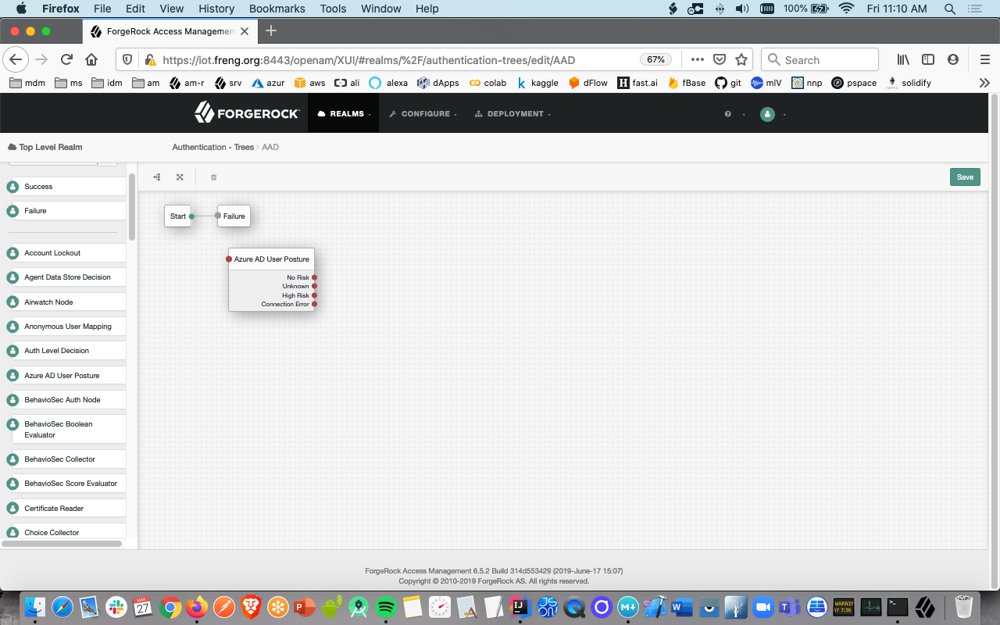
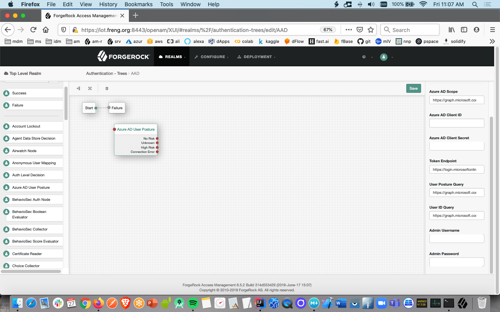
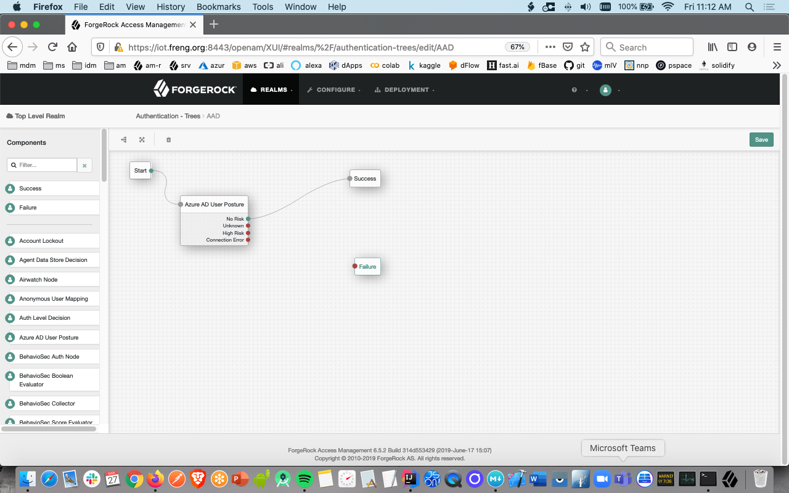
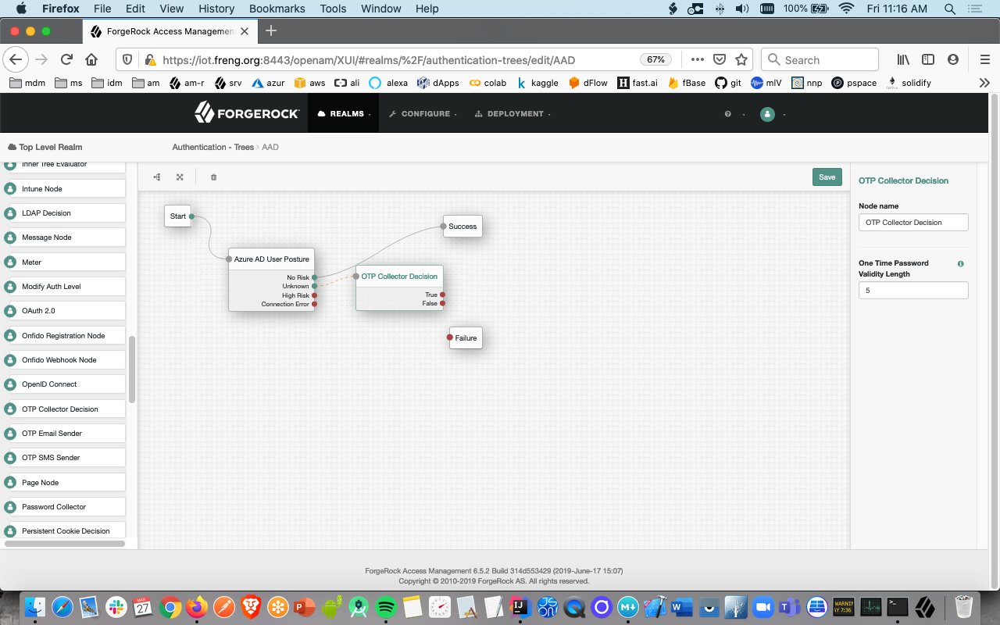
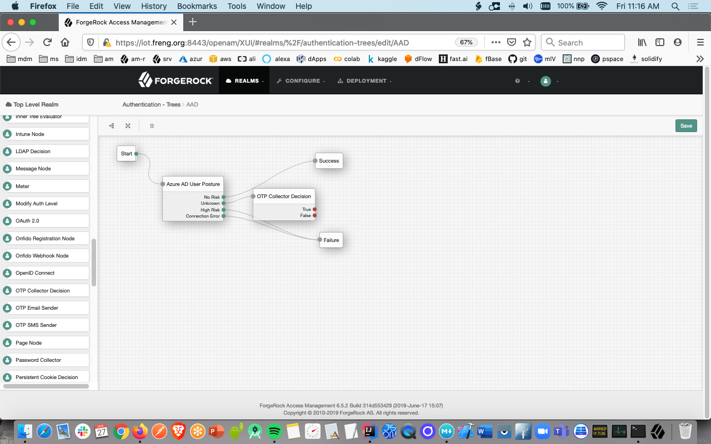
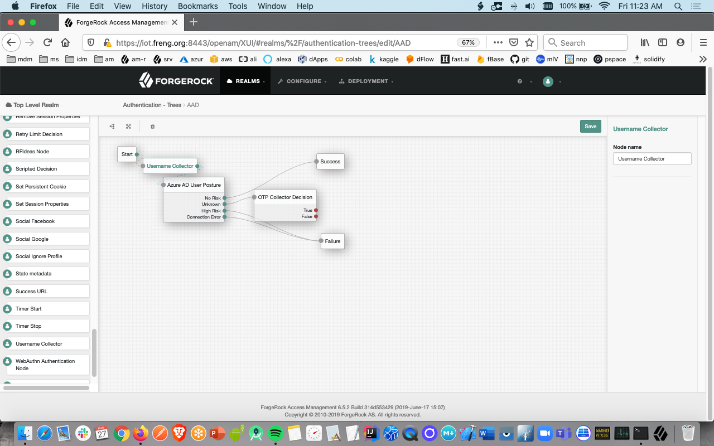

# User Posture - Microsoft Azure Active Directory

This ForgeRock Authentication Tree queries Azure Active Directory (AAD) via the Microsoft Graph to see whether or not the end-user has been deemed compromised (ie, checks the "User Posture") before they are allowed to access a protected resource. The unique identifier needed for said query is the user's email address; with that a first call can be made to the Graph to get the user's GUID, and once the GUID is retrieved, a second call is made to the Graph to get it's Risk Status (see https://docs.microsoft.com/en-us/graph/api/resources/riskyuser).

Said call in the Microsoft Graph can return 1 of 3 results:

1. the user is not a Risk
2. the user is unknown to their Risk engine
3. the user is a High Risk (ie, the Graph deems that they have been compromised).

Only in event #1 is returned does the authentication tree carry on; if #2 is returned an additional step-up challenge could optionally be issued; if #3 is returned the tree exits altogether. 

### Configuration: Microsoft Azure Active Directory

The details for configuring and permissioning AAD are [here](https://docs.microsoft.com/en-us/graph/permissions-reference).
Use Postman or something similar to verify your credentials as [described] (https://docs.microsoft.com/en-us/graph/use-postman).

### Configuration: ForgeRock Authentication Node

Once the above has been done and verified configure an Authentication Tree as follows:

1. Download the Azure-1.0.0-SNAPSHOT from the below ../target directory
2. Copy it to the ../web-container/webapps/openam/WEB-INF/lib directory where your Access Manager instance is deployed.
3. Restart the web container to pick up the new node.  The 'Azure AD User Posture' node will then appear in the authentication trees components palette.
4. From the components pallete select it, drop it in the main pane 
5. Click on the node; configure the values on the far right with values you obtained during the Postman exercise above: 
6. From the components pallete drop-in the Success node and configure the tree this manner: 
7. For the case where AAD returns an 'unknown risk' status, it is up to you to decide if you want to perform an additional step-up challenge, display a message, redirect, etc. In this screen we start a one-time-password challenge only as an example  
8. For the case where AAD returns a 'high risk' status, or a connection cannot be made to AAD, it is up to you to decide if you want to do an account lockout, display a message, etc. In this screen we fail-out of the tree  
9. From the components pallete drop-in the Username node and configure the tree in this manner: 

-

The sample code described herein is provided on an "as is" basis, without warranty of any kind, to the fullest extent permitted by law. ForgeRock does not warrant or guarantee the individual success developers may have in implementing the sample code on their development platforms or in production configurations.

ForgeRock does not warrant, guarantee or make any representations regarding the use, results of use, accuracy, timeliness or completeness of any data or information relating to the sample code. ForgeRock disclaims all warranties, expressed or implied, and in particular, disclaims all warranties of merchantability, and warranties related to the code, or any service or software related thereto.

ForgeRock shall not be liable for any direct, indirect or consequential damages or costs of any type arising out of any action taken by you or others related to the sample code.

[forgerock_platform]: https://www.forgerock.com/platform/  
